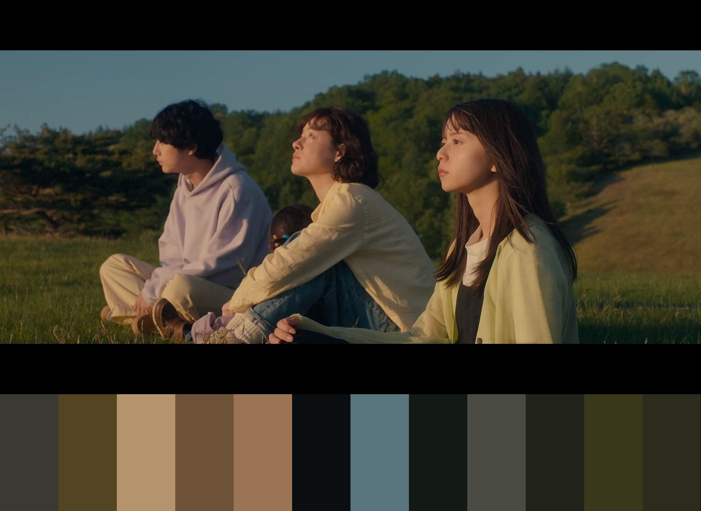

# Image palette generator

Generating image palette using K-means clustering in color space. User provided image can be loaded and program will output selected number of colors that can be considered as significant in image's color palette and an image with palette's visualization. Clustering may be performed in various color spaces, but output values are gamma compressed (regular sRGB color space). By default OKLAB is used and completely black pixels are ignored (this can be changed).

## Quick start

```console
$ cmake .
$ make -j8
$ ./palette -i images/im1.png --iters 50 -n 16
```

## Usage

```
Image palette generator
Usage: ./palette [OPTIONS]

Options:
  -h,--help                   Print this help message and exit
  -i,--input TEXT REQUIRED    Input image
  -n,--num_clusters UINT      Number of clusters
  --iters UINT                Number of clustering iterations
  --color_space TEXT          Color space in which clustering will be performed. Available options are: linear_srgb, srgb, rgG, xyz, oklab (default)
  --padding UINT              Padding between elements on output image
  --bg TEXT                   Background color for generated visualization. Format: "r, g, b"
  --seed UINT                 Seed for random number generator
  --random                    Use random device to seed random number generator (seed parameter will be ignored)
  --dont_skip_black           Will include black pixels in clustering when set to true
  -o,--output TEXT            Output image
```

## Example results

First four images are stills from "Side By Side: Tonari ni Iru Hito" (2023) directed by Chihiro Itô and the last one is from "Fallen Angels" (1995) by Wong Kar Wai.





